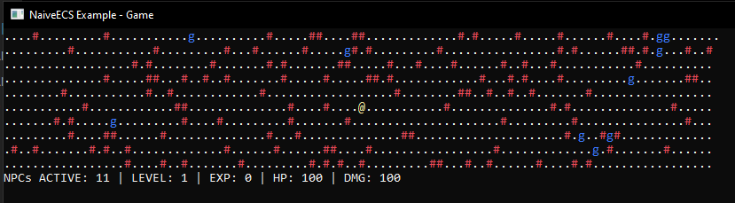

# Overview
A naive implementation of ECS in C# with API heavily inspired by [Morpeh ECS](https://github.com/scellecs/morpeh) made for learning purposes.
In this implementation each entity is an integer, each component is a struct. The core gives you the ability to create entities, manage them and their components. The core does not handle systems, this is up to the user. However, the extension folder contains some syntax sugar to make system creation easier.

## Structure
### Core
The core of the ECS, contains the entity cache, component cache and filter. The core is responsible for creating entities, adding components to entities and filtering entities based on their components.
World is the main class of the core, it contains the entity cache and component cache. It is responsible for creating entities, adding/removing components to/from entities.

### Example
A code example of a basic console roguelike game. Walk around map and kill goblins



### Extensions
Syntax sugar and QOL improvements such as system interface ISystem and entity extension methods for managing components

### Tests
Unit tests that I really have no idea about, but seems like they do work just fine.

# Code examples

Creating a world. The default world is a singleton, but you can create multiple worlds if you want.

```csharp
var world = World.Default();
var myOwnWorld = new World();
```

Creating an entity

```csharp
var world = World.Default();
var entity = world.CreateEntity();
```

Adding a component to an entity. Each component is a *struct* that must implement the *IComponent* interface. 

```csharp
public struct Position : IComponent {
    public float X;
    public float Y;
}
```

```csharp
var world = World.Default();
var entity = world.CreateEntity();
var position = new Position { X = 1, Y = 2 };
entity.SetComponent(ref position);
```

Getting a component from an entity and modifying it. By using the *ref* keyword you can get a reference to the *struct* component, allowing you to modify it directly.
```csharp
var filter = new Filter().With<Position>();

foreach (var entity in filter) {
    var position = world.GetComponent<Position>(entity);
    position.X += 1;
    entity.SetComponent(ref position);
    Console.WriteLine($"Entity {entity} has position {position.X}, {position.Y}");
}
```

Commiting changes to entities. After you have modified entities you need to commit the changes to the world. This is done by calling *Commit* on the world.
Commit will update the entity cache and component cache, and remove entities that have been marked for deletion. This way we ensure that collections are not modified while being iterated over.
```csharp
public void Run(float deltaTime)
{
    foreach (var system in _systems)
    {
        system.Update(deltaTime);
        World.Default().Commit();
    }
}
```

# Reference material

API - https://github.com/scellecs/morpeh

NUnit - https://nunit.org/

Avoiding struct boxing - https://giannisakritidis.com/blog/Avoid-Struct-Boxing/

 - https://www.sebaslab.com/casting-a-struct-into-an-interface-inside-a-generic-method-without-boxing/